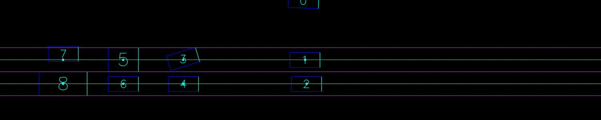

# About The Project
This is a framework for creating traffic environment simulations. Here is an example simulation:

<!--- () --->

# Requirements
PyTorch, Numpy, Gymnasium, OpenCV2

# Usage
All code is documented, you can refer to the files for more detail.
* **AngledRectangleTensor** defines the geometry of the vehicles. You can edit this file if you want to have different geometries.
It also renders the vehicles.
* **TrafficTensor** inherits *AngledRectangleTensor* and defines the lanes, and the position of cars in that lane. If you want to add additional rules about the lanes, you can edit this file. It also renders the lanes.
you can add it here.
* **LiveTrafficTensor** inherits *TrafficTensor* and defines the dynamics of the vehicles. Right now, the environment uses Kinematic Bicycle Model.
You can edit this file to change the dynamics of the environment. You can add friction, sliding, etc..
* **AdjustedLiveTrafficTensor** inherits *LiveTrafficTensor* and defines adjustments to the observation and action space. If you want to change the
observation or action space of your environment (e.g. normalization) and change nothing else; and you want this change to register to 
every car in the environment, not just the agent, then you can give the required functions to this class, or its super classes.
* **TrafficEnvironment** inherits *LiveTrafficTensor* and then *gym.Env* from gymnasium library. This is the overall environment, you can provide the required values and run the environment. The description of attributes can be found in *TrafficEnvironment.\_\_init\_\_*.

# Contact
kaan.buyukdemirci@ug.bilkent.edu.tr, kaanbuyukdemirci2023@gmail.com

# License

# TODO
* Write and run tests.
* Make the environment compatible with multiple agents.
* Example implementation of level 0 agent
* Example implementation of adjuster
* Profiling

